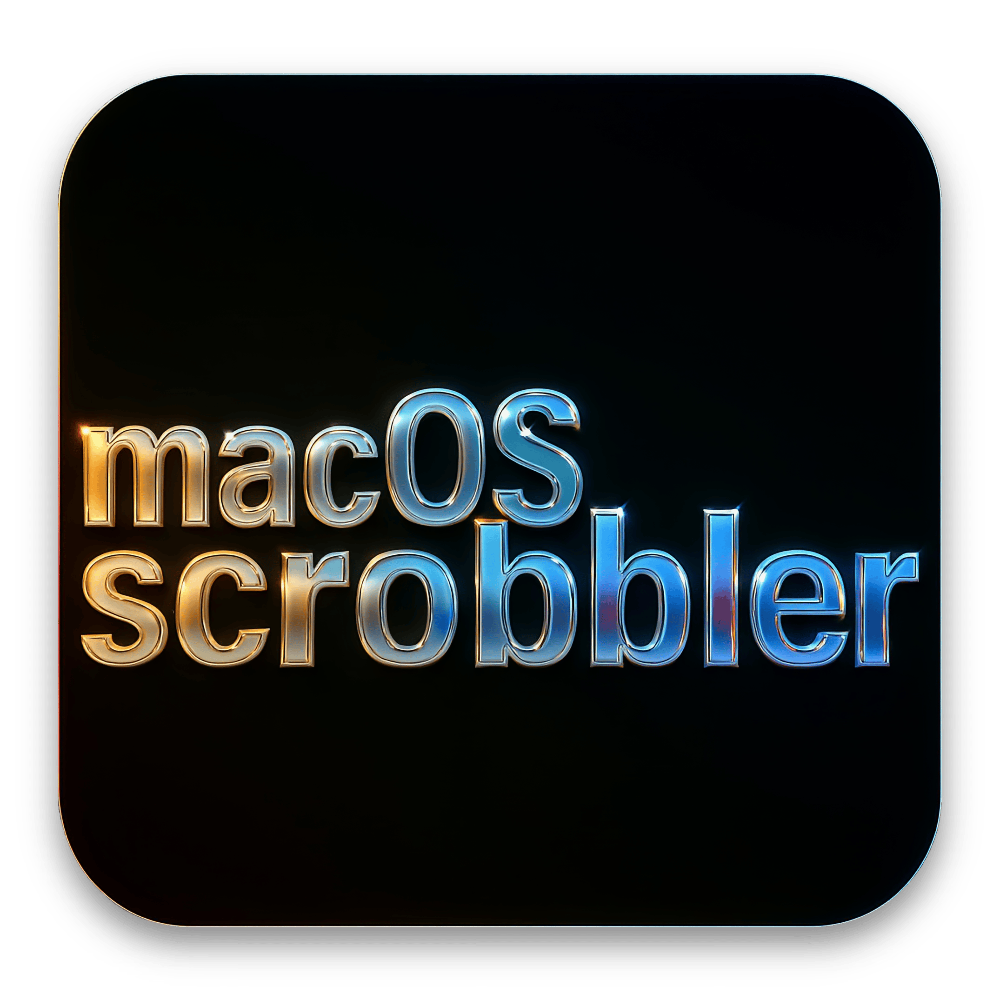

# 🎵 Apple Music to Last.fm - macOS Scrobbler

<p align="center">
  
</p>

This tool automatically scrobbles your currently playing Apple Music tracks to [Last.fm](https://www.last.fm). It runs in the background on macOS using AppleScript and a `launchd` service.

---

## ⚙️ Requirements

* macOS with Apple Music app
* A Last.fm account
* [Last.fm API account](https://www.last.fm/api/account/create) (to obtain your API key & secret)
* Command line tools: `bash`, `osascript`, `curl`, `md5sum` (via `coreutils` or `brew install coreutils` if needed)

---

## 🚀 Installation

1. **Clone the repository:**

```bash
git clone https://github.com/morpson/applemusic_macos_scrobbler.git
cd apple-music-lastfm-scrobbler
```

2. **Install the scrobbler script:**

This script runs every 60 seconds and checks the currently playing track in Apple Music.

```bash
cp apple_music_lastfm_scrobbler.sh ~/
chmod +x ~/apple_music_lastfm_scrobbler.sh
```

3. **Install the launch agent:**

```bash
mkdir -p ~/Library/LaunchAgents
cp com.user.apple_music_lastfm_scrobbler.plist ~/Library/LaunchAgents/
```

---

## 🔐 Set Up Your Last.fm Credentials

To allow the script to scrobble to your Last.fm account, you'll need a **session key**. We provide two options:

### 🔁 Option 1: Interactive Setup (Recommended)

Run this script to guide you through the process of authenticating with Last.fm and updating the main script:

```bash
./get_lastfm_session_key.sh
```

This script will:

* Prompt for your **API key** and **API secret**
* Open the authorization URL in your browser
* Ask you to paste in the returned **token**
* Exchange it for a **session key**
* Insert all three values into your scrobbler script

✅ At the end, the script will automatically start the background scrobbler service.

---

### 🛠️ Option 2: Manual Setup (if you already have credentials)

If you already have:

* An **API key**
* An **API secret**
* A valid **session key**

Then run:

```bash
./update_scrobbler_credentials.sh
```

It will prompt you for these values and update `~/apple_music_lastfm_scrobbler.sh` accordingly.

---

## 🔄 Start the Scrobbler

Once your credentials are set, start the service:

```bash
launchctl load ~/Library/LaunchAgents/com.user.apple_music_lastfm_scrobbler.plist
launchctl start com.user.apple_music_lastfm_scrobbler
```

To restart or reload:

```bash
launchctl unload ~/Library/LaunchAgents/com.user.apple_music_lastfm_scrobbler.plist
launchctl load ~/Library/LaunchAgents/com.user.apple_music_lastfm_scrobbler.plist
```

---

## 🧪 Test It Works

Play a track in Apple Music. Then check the logs:

```bash
tail -f ~/Library/Logs/apple_music_lastfm_scrobbler.log
```

You should see output indicating the currently playing track and scrobble status.

---

## 🧹 Uninstall

To remove the scrobbler:

```bash
launchctl unload ~/Library/LaunchAgents/com.user.apple_music_lastfm_scrobbler.plist
rm ~/Library/LaunchAgents/com.user.apple_music_lastfm_scrobbler.plist
rm ~/apple_music_lastfm_scrobbler.sh
```

---

## 🔒 Security Note

Do **not** share your API key, API secret, or session key publicly. The scripts are now designed to prompt for your credentials securely — no sensitive data is stored in version control.

---

## 📄 License

MIT License — see `LICENSE` file.

---
